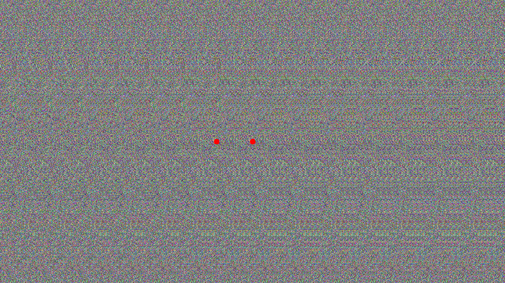

# Pyllusion

A Python Module for Generating Visual Illusions

## Installation

    pip install https://github.com/DominiqueMakowski/Pyllusion/zipball/master

## Features

### Autostereograms

[Autostereograms](https://en.wikipedia.org/wiki/Autostereogram) are
images made of a pattern that is horizontally repeated (with slight
variations) which, when watched with the appropriate focus, will
generate an illusion of depth.

For instance, in the image below, the `autostereogram` automatically
adds a guide (you can disable it by setting `guide=False`), the two red
dots. Look at them and relax your eyes until you see a new red dot
between them two. Then, try focusing on this new red dot until it gets
very sharp and until your eyes stabilize. You should then be able to
perceive the letters **3D** as carved in the figure

It can take a bit of time to “get there”, but once you are used to it,
it’s a mind-blowing experience 🤯

``` python
import pyllusion as pyl

pyl.autostereogram(stimulus="3D", width=1600, height=900)
```



The function is highly customisable, and we can use a black and white
image as a **depth mask** (in this case, the [picture of a
skull](https://github.com/DominiqueMakowski/Pyllusion/docs/img/depthmask.png)
that you will see as emerging from the background), and customise the
pattern used by providing another function (here, the `image_circles()`
function to which we can provide additional arguments like `blackwhite`,
the number of circles `n` and their transparency with `alpha`).

``` python
pyl.autostereogram(stimulus="docs/img/depthmask.png",
                   pattern=pyl.image_circles,
                   blackwhite=True,
                   alpha=0.75,
                   n=1000)
```


