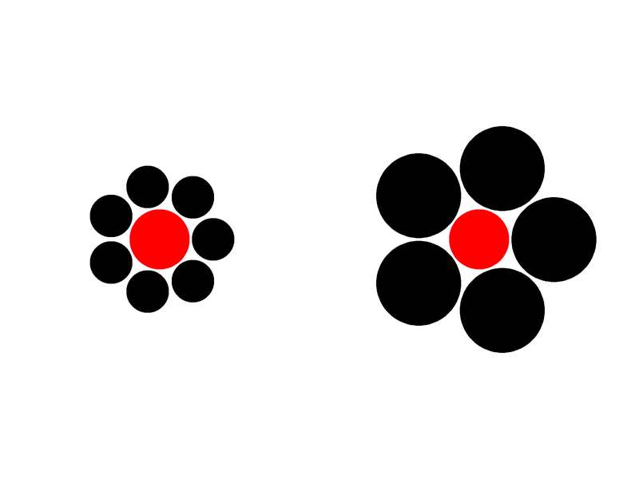
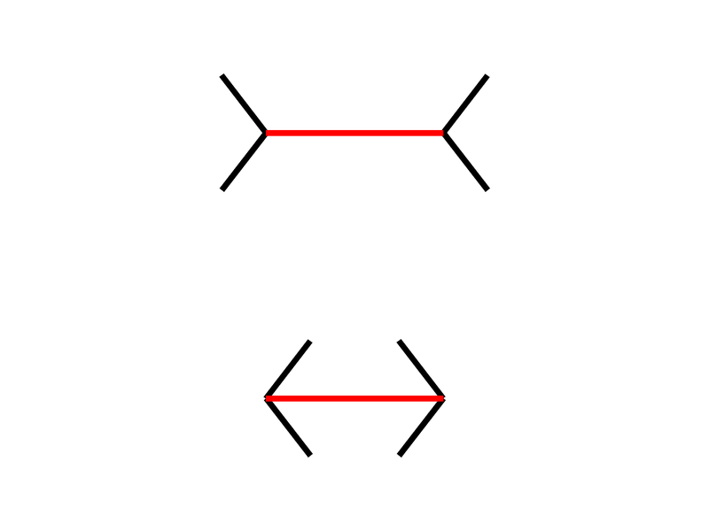
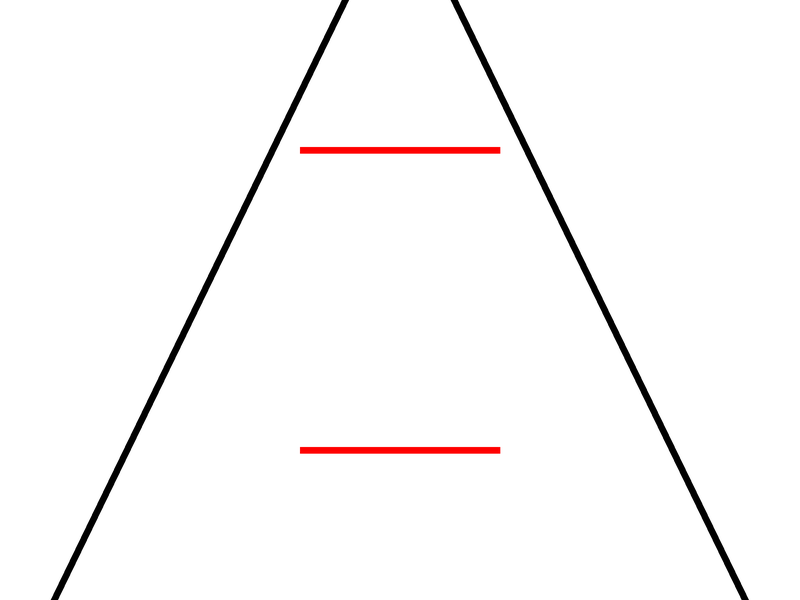
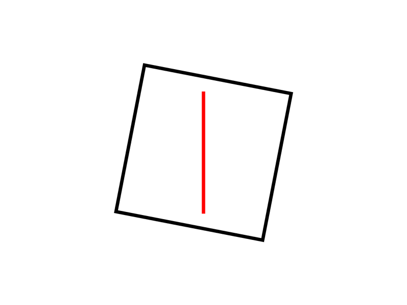
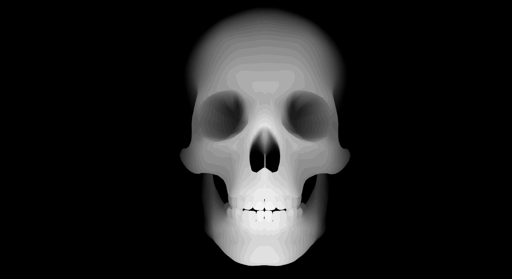
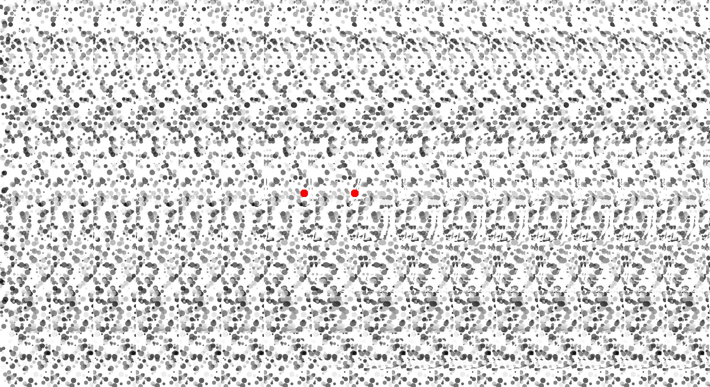

<p align="center">


</p>

<h5 align="center">

*A Python Module for Generating Visual Illusions*

</h5>

# Overview

Visual illusions are fascinating phenomena that have been used and
studied by artists and scientists for centuries, leading to important
discoveries about how conscious perception is generated by the brain.
Instead of crafting them by hand, **Pyllusion** offers a framework to
manipulate and generate illusions in a systematic way.

The parametric approach implemented in this software is based on
**describing illusions using a set of parameters**, such as for instance
`difference` and `illusion_strength`, that will independently impact
either the objective difference of the core components of the illusion
(e.g., the difference between the two segments in the
[Müller-Lyer](#müller-lyer-illusion-illusion) illusion) or the
intensity of the illusion effect (e.g., the angle of the “distractors”
arrows). Describing illusions using a set of parameters could foster
**reproducible science**, as similar stimuli can be generated and
manipulated regardless of the display format and software.

## Installation

    pip install https://github.com/DominiqueMakowski/Pyllusion/zipball/master

## Contribution

You have some ideas? Want to improve things, add new illusions, and help
us shake people’s brain? Let us know, we would be very happy to have you
on board :relaxed:.

## Citation

You can cite the package as follows:

    Makowski, D. (2020). Pyllusion: A Python Module for Generating Visual Illusions. GitHub. 
    Retrieved from https://github.com/DominiqueMakowski/Pyllusion

## Features

### Delboeuf Illusion

The [**Delboeuf
illusion**](https://en.wikipedia.org/wiki/Delboeuf_illusion) is an
optical illusion of relative size perception, where circles of identical
size appear as different because of their surrounding context. The
illusion was named for the Belgian philosopher, mathematician,
experimental psychologist, hypnotist, and psychophysicist Joseph Remi
Leopold Delboeuf (1831–1896), who created it in 1865.

``` python
import pyllusion as ill

parameters = ill.delboeuf_parameters(illusion_strength=3)

ill.delboeuf_image(parameters)
```


### Ebbinghaus Illusion

The [**Ebbinghaus
illusion**](https://en.wikipedia.org/wiki/Ebbinghaus_illusion) is an
optical illusion of relative size perception, where circles of identical
size appear as different because of their surrounding context (the right
red circle appears as smaller). The illusion was named after its creator
the German psychologist Hermann Ebbinghaus (1850–1909), though it got
popularized by Edward B. Titchener in a 1901 textbook of experimental
psychology.

``` python
parameters = ill.ebbinghaus_parameters(illusion_strength=2)

ill.ebbinghaus_image(parameters)
```



### Müller-Lyer illusion Illusion

The [**Müller-Lyer
illusion**](https://en.wikipedia.org/wiki/M%C3%BCller-Lyer_illusion) is
an optical illusion causing the participant to perceive two segments as
being of different length depending on the shape of the arrows. The
illusion was named after its creator the erman sociologist Franz Carl
Müller-Lyer (1857–1916) in 1889.

``` python
parameters = ill.mullerlyer_parameters(illusion_strength=30)

ill.mullerlyer_image(parameters)
```



### Ponzo Illusion

The [**Ponzo illusion**](https://en.wikipedia.org/wiki/Ponzo_illusion)
is an optical illusion of relative size perception, where horizontal
lines of identical size appear as different because of their surrounding
context (the top line appear as longer, as it is interepreted as being
in the distance). The illusion was named after its creator the Italian
psychologist Mario Ponzo (1882–1960) in 1911, who suggested that the
human mind judges an object’s size based on its background.

``` python
parameters = ill.ponzo_parameters(illusion_strength=20)

ill.ponzo_image(parameters)
```



### Rod and Frame Illusion

The [**Rod and frame
illusion**](https://en.wikipedia.org/wiki/Rod_and_frame_test#Rod_and_frame_illusion)
is an optical illusion causing the participant to perceive the rod to be
oriented congruent with the orientation of the frame.

``` python
parameters = ill.rodframe_parameters(illusion_strength=11)

ill.rodframe_image(parameters)
```



### Zöllner illusion Illusion

  - **TO DO** *(consider helping\!)*

### Münsterberg Illusion (Café Wall)

  - **TO DO** *(consider helping\!)*

### White illusion

  - **TO DO** *(consider helping\!)*

### Autostereograms

[Autostereograms](https://en.wikipedia.org/wiki/Autostereogram) are
images made of a pattern that is horizontally repeated (with slight
variations) which, when watched with the appropriate focus, will
generate an illusion of depth.

For instance, in the image below, the `autostereogram` automatically
adds a guide (you can disable it by setting `guide=False`), the two red
dots. Look at them and relax your eyes until you see a new red dot
between them two. Then, try focusing on this new red dot until it gets
very sharp and until your eyes stabilize. You should then be able to
perceive the letters **3D** as carved in the figure

It can take a bit of time to “get there”, but once you are used to it,
it’s a mind-blowing experience 🤯

``` python
ill.autostereogram(stimulus="3D", width=1600, height=900)
```


The function is highly customisable, and we can use a black and white
image as a **depth mask** (in this case, the [picture of a
skull](https://github.com/DominiqueMakowski/Pyllusion/docs/img/depthmask.png)
that you will see as emerging from the background), and customise the
pattern used by providing another function (here, the `image_circles()`
function to which we can provide additional arguments like `blackwhite`,
the number of circles `n`, their size range and their transparency with
`alpha`).



``` python
ill.autostereogram(stimulus="docs/img/depthmask.png",
                   pattern=ill.image_circles,
                   blackwhite=True,
                   alpha=0.75,
                   size_min=0.005,
                   size_max=0.03,
                   n=1000)
```



## References

Bertamini, M. (2017). [*Programming visual illusions for
everyone*](https://www.programmingvisualillusionsforeveryone.online).
Springer.
